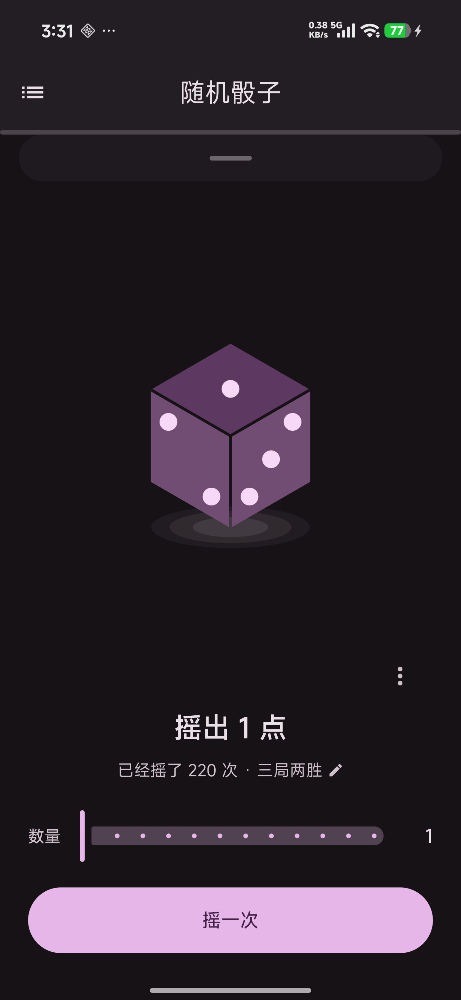
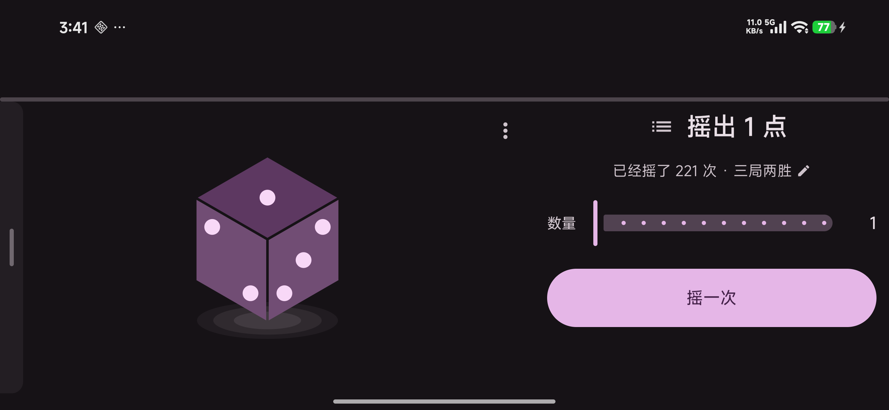

# 随机骰子 RandomDice

一个**离线**的掷骰子小工具，用来给生活里那些"不重要、但懒得决定"的事情做判决 ——
摇完不只给点数，而是直接给一句结论（执行 / 不执行 / A / B / 大吉…），再让你把"这次决定了什么"记下来回头翻。

Kotlin + Jetpack Compose + Material 3。**不联网、不要账号、没有广告、没有统计**，所有数据只在你自己手机的私有目录里。

<p align="center">
  
  &nbsp;&nbsp;
  
</p>

---

## 它能做什么

- **一次摇 1~12 个**：一个一个摇，顶部进度条分段填满，摇完的骰子左滑出场；中途可以停止。
- **判决规则**：摇完自动给结论，7 套预设，参数可调，改完立刻生效（入口就在"已经摇了 N 次"那行）。
- **终局那屏**：`摇出 X 点` / `已经摇了 N 次 · 规则摘要 ✎` / `本次决策：[结论 ▾] [自定义]` / `[这次要决定的事] [忽略] [✓]`。
- **决策记录**：点数、结论、判决、规则快照、题目一起存下来，可回看、可删除。
- **摇一摇**：摇手机就开始一轮（默认关）。
- **震动 / 音效**：和骰子的翻滚**真同步**（见下），都能关，音效有 5 种材质可选。
- **横竖屏**：横屏是左右分栏 —— 左边骰子 + 侧边抽屉（往右抽看本轮点数），右边一列控制件。

## 判决规则

"摇出什么" → "所以怎么办" 的翻译表。默认是 **三局两胜 · 单数算赢**（只摇一颗时它自动退化成"单数执行、双数不执行"）。

| 预设 | 怎么判 | 参数 |
|---|---|---|
| 不用规则 | 只记点数，结论自己写 | — |
| 单双定夺 | 看第 1 颗或合计，单/双 | 看哪里、单数算哪边 |
| 三局两胜 | 每颗算一局，赢的过半执行 | 单数算赢 / 双数算赢 |
| 几选一 | 合计取模落到 A、B、C… | 选项个数 2~6 |
| 吉凶 | 只看第 1 颗：6 大吉、1 凶、其余平 | — |
| 阈值定夺 | 看第 1 颗或合计，够 N 就执行 | 看哪里、阈值 1~72 |
| 点名定夺 | 点名的点数出现够多颗就执行 | 点名 1~6、至少几颗 |

判决会**连依据一起给出**（"3 颗里 2 颗是单数"、"合计 17 < 18"），终局那行还能手动换一项，或者干脆自己写一句当结论。

## 三个不太一般的实现

### 1. 骰子是自己画的，没有引 3D 引擎

等轴测投影 + 自写的三轴旋转（`R = Ry · Rx · Rz`）。`dice/DiceGeometry.kt` 里只有点、面、角点和欧拉角，
**画面和"哪面朝上"共用同一份旋转实现** —— 不然就会出现"画面停在 6、记下来的却是 3"。

### 2. 震动和音效是"物理同步"的

不是按时间硬凑的节奏，而是**先扫出撞击时刻表**：

```
起止姿态 + 动画时长（900/1040/1160ms，同一条 FastOutSlowIn 缓动）
        ↓  每 8ms 采一次姿态
   哪个角成为最低点（"角砸地"）
        ↓
   撞击时刻表 [{atMs, speed01}]
        ↓                    ↓
  VibrationEffect 波形   合成的 PCM
   （一次交给系统）      （AudioTrack MODE_STATIC）
```

转得快时每 8ms 换一次角（一片嗡），转慢后自然稀疏（一下一下），最后停之前留一小段静音、再来一记最重的落定。
音效同理：每次撞击是一小段"噪声瞬态 + 几个阻尼正弦"，材质（木头/塑料/陶瓷/厚重/混合）就是这组参数。

> ⚠️ 震动**因机器而异**：同一个波形在不同马达上差别很大，所以有个总开关（右下角 ⋮ 托盘里）。

### 3. 零新增依赖，逻辑全在纯函数里

- 存储：没有 Room / DataStore / JSON 库 —— 应用私有目录里两个文本文件 + 纯 Kotlin 编解码；
- 图标：只有 BOM 自带那套 `material-icons-core`，缺的（摇一摇的骰子、手机、喇叭）自己写 `ImageVector`；
- 音频：没有音频素材，合成；
- 能纯函数的一律纯函数：几何、判决、撞击扫描、波形合成、PCM 合成、编解码 ——
  `./gradlew :app:testDebugUnitTest` 是 **90 多个纯 JVM 用例**（不依赖模拟器）。

## 踩过的坑（都写进注释了，这里汇总）

| 坑 | 症状 | 结论 |
|---|---|---|
| 两轴旋转不够 | ±X 面（3/4 点）永远朝不上 | 必须三轴，`DiceGeometryTest` 守着 |
| `FastOutSlowInEasing` 在 t=0 斜率是 0 | 以为"起手最快"，其实动画先加速 | 撞击力度要跟着**真实转速**走，别照搬假设 |
| `VibrationEffect.createWaveform` 按下标奇偶解释"震/停" | 出现两个连续"震"之后，整条被读反（该震的变静音） | 相邻撞击必须**并进上一段**，有单测钉着 |
| `Modifier.width` vs `requiredWidth` | 抽屉抽开时文字逐字换行、骰子被压成一条 | 内容宽度要被动画那层窄约束无视时，用 `requiredWidth` |
| `graphicsLayer { alpha = alpha }` | 参数名撞上作用域属性，变成自我赋值 | 参数改名（`buttonAlpha`） |
| `remember` vs `rememberSaveable` | 去记录页再回来，"未记录的决策"整块消失 | 跨页面留得住的状态必须 saveable |
| 系统的 `haptic_feedback_enabled` 不可信 | 华为报 0，而它自己的桌面照样在震 | 别拿它当闸门，交给平台自己的策略 |
| 幅度映射写反 | "越快越轻" | 被单测当场抓住 —— 测性质比测数值有用 |

## 项目结构

```
app/src/main/java/com/xfy/randomdice/
├─ dice/     DiceGeometry（点/面/角/旋转）、Judgment（判决规则）、RollImpacts（撞击扫描）
├─ audio/    RollSound（合成）、RollSoundPlayer（AudioTrack）
├─ data/     DecisionRecord / DiceSettings（纯 Kotlin 编解码）、两个 Store
└─ ui/       DiceScreen、ToolTray、RoundResultsCard / SidePanel、DecisionChoiceRow、
             DecisionPrompt、DecisionsScreen、RuleEditorSheet、ShakeDetector、
             RollHaptics、自写的 ImageVector 图标
```

## 数据格式

都在应用私有目录（`/data/data/com.xfy.randomdice/files/`），制表符分隔、一行一条，**加字段一律往行尾追加**，所以老文件永远读得回来（缺的当默认值）。

```
settings.txt   累计颗数 \t 预设 \t 基准 \t 单数算第一个结果 \t 选项个数 \t 阈值 \t 点名点数 \t 至少几颗 \t 摇一摇 \t 震动 \t 音色
decisions.txt  时间戳 \t 点数,点数,… \t 决策 \t 规则判决 \t 规则快照 \t 要决定的事
```

## 构建

```bash
./gradlew :app:testDebugUnitTest    # 90 多个纯 JVM 用例
./gradlew :app:assembleDebug        # 出 debug 包
./gradlew :app:installDebug         # 装到连着的设备上（保留数据）
```

AGP 8.12.3 / Gradle 8.14.5 / Kotlin 2.0.21 / Compose BOM 2024.12.01，minSdk 28、targetSdk 36，需要 JDK 17+。
`settings.gradle.kts` 里配了阿里云 + 腾讯的镜像源（国内网络直连 Maven Central 经常断）。

## 已知取舍

- 只有六面骰（几何表是按立方体写的，D10/D20 得另做）；
- 记录只能删、不能改，也没有导出/分享；
- 音效是合成的，不是真实骰子采样（想要真声就得引音频素材）；
- 震动因机器而异，横屏是另做的一套排法而不是响应式重排。
